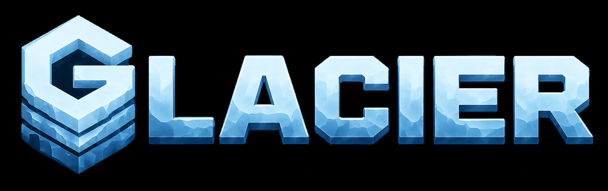
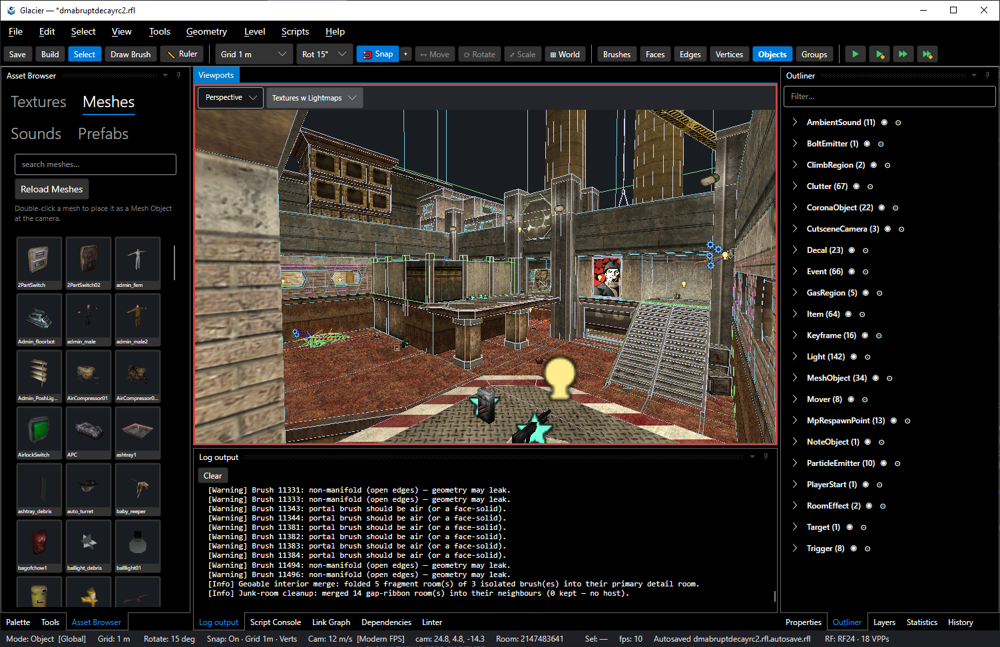

<p align="center">
  
</p>

<p align="center">
  <b>A modern level editor for Red Faction (2001).</b>
</p>

<p align="center">
  
  
  
</p>

<p align="center">
  
</p>

**Glacier** — GED, short for **Glacier EDitor** — is a clean-room reimplementation of the Red Faction `.rfl` level editor, built in .NET 8 + Avalonia. It targets **stock-RED editor parity** and **Alpine Faction editor parity**, then layers **modern editing conveniences** on top of both — real gizmos, unlimited undo that survives save, live CSG preview, link graph, detailed layer view and object outliners, one-click packaging, prefabs, dependency explorer, and full Lua scripting workflow support.

**Glacier** helps to make Red Faction level design accessible and approachable for those more familiar with modern design tools like Unity, Unreal Engine, or Blender; while also providing long awaited tools and workflow improvements for to veteran level designers.

## Highlights

- **Reads all RF1 RFLs** — opens every stock version (`0xB4`–`0xC8`) and every Alpine
  version (`300`–`305`) with a byte-preserving round-trip.
- **RED-authentic geometry & lighting** — the full compile pipeline (time-ordered brush
  booleans → portal chopping → room building → t-joint fixing → lightmap UV) plus a
  multithreaded, byte-exact lightmap baker (point / spot / tube, shadows) that reproduces
  RED's per-texel kernel, with optional Alpine smoothlights quality.
- **Modern editing over stock parity** — interactive move / rotate / scale gizmos, keyboard
  transforms, **unlimited undo/redo that survives save**, live CSG preview, and a full UV
  unwrap editor — without giving up any stock brush, face, or vertex operation.
- **Everything a level needs** — every object type with data-driven inspectors, all 90 stock
  events and all 58 Alpine events, links with the interactive **Link Graph** editor, and full
  trigger / mover / group / cutscene authoring.
- **Assets & packaging** — a dockable Asset Browser (textures / meshes / sounds), one-click
  `.vpp` packaging with a full dependency scanner, import/export (OBJ / FBX / glTF / DAE),
  and a prefab system.
- **Playtest & polish** — one-key playtest in stock RF or the Alpine launcher (single &
  multiplayer), a first-run wizard, fully bindable hotkeys with RED Classic / Modern presets,
  a command palette, dark/light themes, and Direct3D 11 + OpenGL backends on Windows & Linux.

**[→ Full feature catalog](docs/catalog.md)** for the complete, detailed breakdown.

## Quick start

1. **First-run wizard.** On first launch, GED helps you locate and validate your Red Faction
   install, pick a keymap preset (**RED Classic** or **Modern**), a camera scheme, and a
   theme. Your install's VPPs are mounted automatically the first time you open a level.
2. **Open a level.** File ▸ Open, drag a `.rfl` onto the window, or pass `--open <file>`.
3. **Build geometry.** Compile from the Level menu or toolbar — builds run in the background
   and never block the UI.
4. **Bake lighting.** Calculate Lightmaps / Calculate Lighting (**L** / **Shift+L**).
5. **Create a level packfile.** Build a `.vpp` with the dependency scanner and review dialog.
6. **Play.** **F7** Play Level, **F8** Play from Camera, **F9** Play in Multi,
   **F10** Play in Multi from Camera.

## Requirements

- **Windows 10/11 x64** (Direct3D 11 GPU; the WARP software rasterizer works as a fallback),
  or **Linux x64** (Wayland via XWayland or X11; renders through a cross-platform OpenGL 3.3
  host, so Mesa's `llvmpipe` software GL works too).
- **A Red Faction installation** — your own game files. GED loads textures, meshes, and
  `.tbl` tables directly from the install's VPP packfiles. **GED never redistributes game
  assets**; they remain your own copy.
- **Alpine Faction** — powers Alpine-only editor features and multiplayer playtest launching.

## Files & settings

GED is a **portable app**: everything it writes lives **next to the executable**, so you can
drop it on a USB stick or in any folder and keep your setup with it. No installer, no
registry, nothing left in your user profile.

| File / folder | What it holds |
| --- | --- |
| `settings.cfg` | Your settings (install path, viewport prefs, theme, MRU, colors). |
| `keymap.cfg` | Your key bindings (preset + overrides). |
| `logs\` | Crash logs and a rolling `session.log`. |
| `cache\` | Texture/mesh thumbnail cache (safe to delete; regenerated on demand). |
| `prefabs\` | The default prefab library (relocatable in Settings). |
| `recovery\` | Emergency autosaves written if the editor crashes mid-edit. |

If the app's folder isn't writable (e.g. installed under `Program Files`, or an AppImage
mount), GED falls back to your user profile so nothing is lost silently, and shows a one-time
notice. See **[Building & running](docs/building.md)** for the exact per-platform paths.

## Building from source

Requires the **.NET 8 SDK**:

```
dotnet build Glacier.sln -c Release
dotnet run --project src/Ged.App
```

Full build, packaging, and platform-specific instructions (Windows and Linux, including
AppImage packaging and Wine playtesting) are in **[docs/building.md](docs/building.md)**.

## License

Copyright (c) 2026 Chris "Goober" Parsons. See `LICENSE` for the terms that apply to Glacier.
Third-party and adapted-code attributions are in `licensing-info.txt`. Red Faction game
assets are your own files and are never shipped with GED.

## Trademarks

The **Glacier** name is not covered by the MIT license. You are welcome to use it to refer to
the official, unmodified builds. If you distribute a modified version, please give it a
different name and do not imply endorsement by the author.
